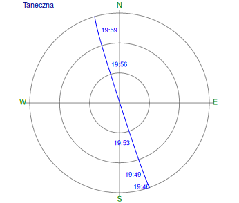
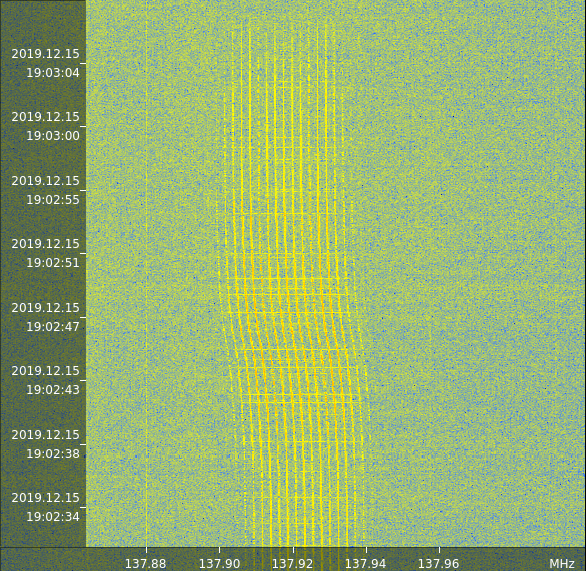
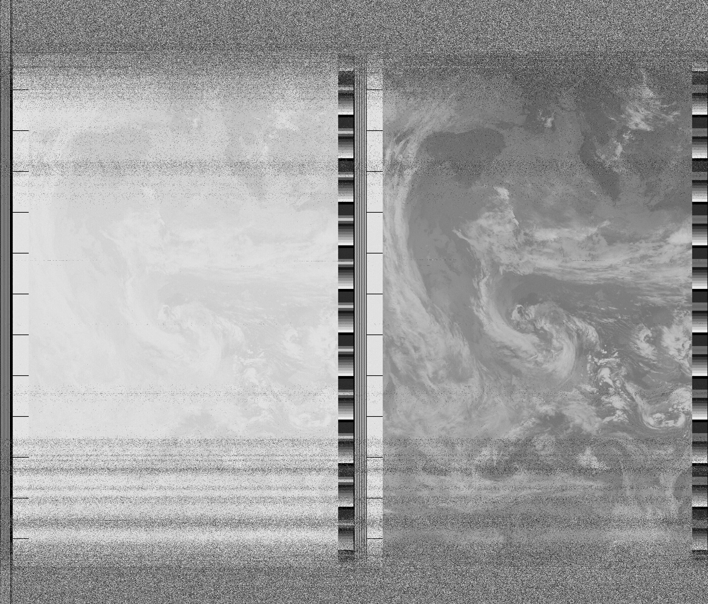

Nagrywający: Sławek
AOS: 2019-12-15 19:46:48
LOS: 2019-12-15 20:02:54

Przelot centralnie nad anteną.

Zastanawiające jest zmiana częstotliwości sygnału w trakcie przelotu nad stacją (efekt Dopplera?).s

