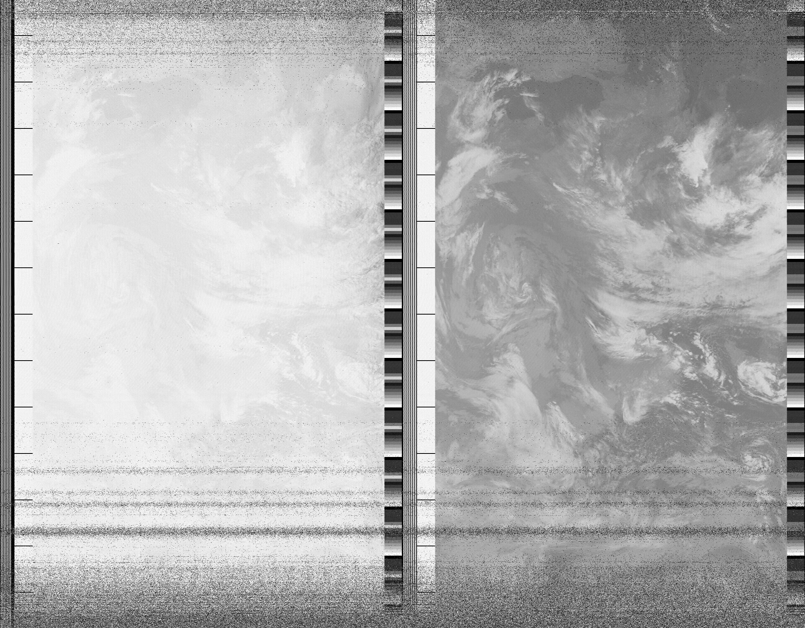
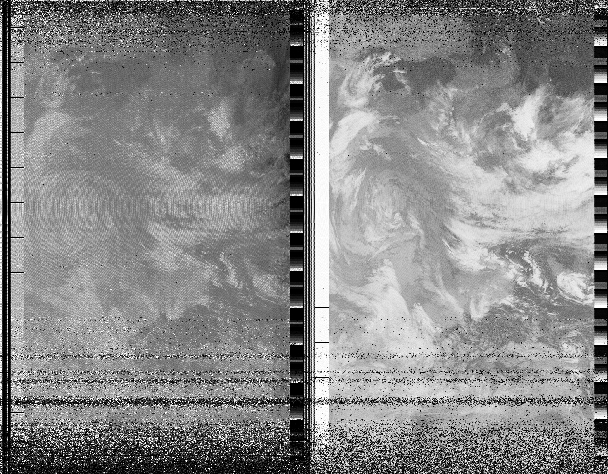

Nagrywający: Tomek
AOS: 2019/12/16 14:59:20 UTC
LOS: 2019/12/16 15:15:12 UTC

Dane przelotu: [link](NOAA-19-55945.txt)

Przelot wysoko (76 stopni).

Nie obserwowalem znaczącej zmiany częstotliwości. Dobre, silne prążki nawet dla satelity bardzo nisko nad horyzontem (dla 4 stopni
nadal wyraźnie widoczny sygnał). Zdjęcie dobrej jakości, ale mało kontrastowe. Zrobiłem prymitywną obróbkę krzywymi w GIMPie.

