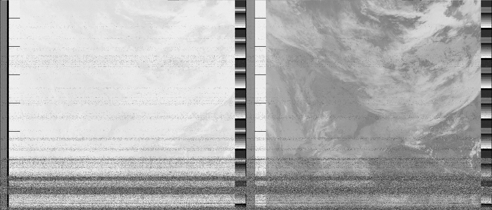
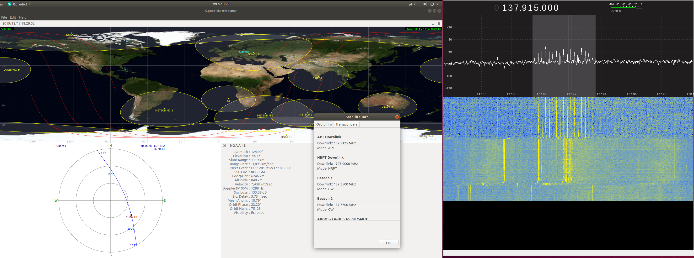
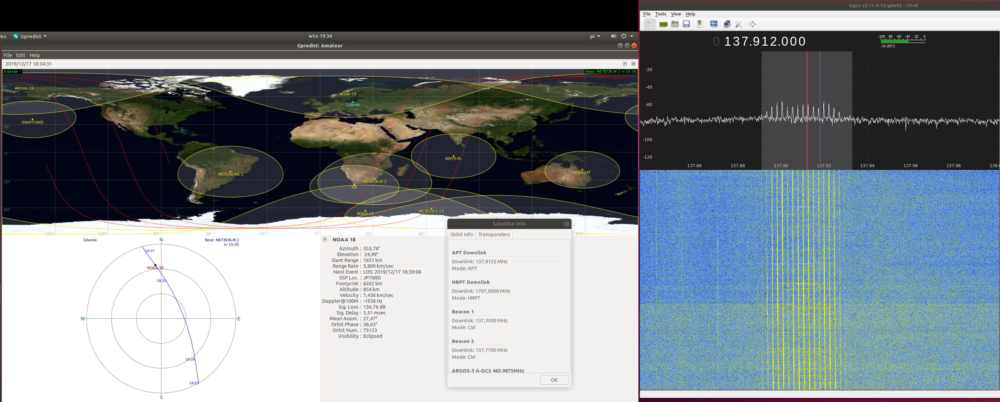

Nagrywający: Tomek
AOS: 2019/12/17 18:23 UTC
LOS: 2019/12/17 18:37 UTC

Dane przelotu: [brak]

Przelot wysoko (63 stopni).

Nie udalo sie nagrac od poczatku ze wzgledu na problemy techniczne z desktopem. Nie zapisalem tez
detali przelotu. Zdjecie w miare sensowne, ale jak zwykle malo kontrastowe.

